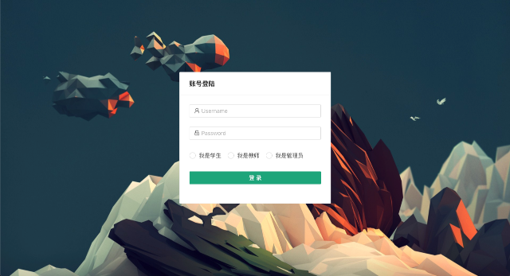
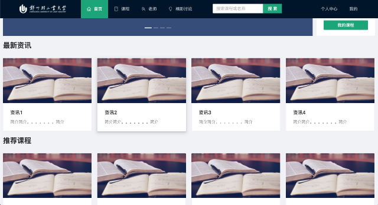
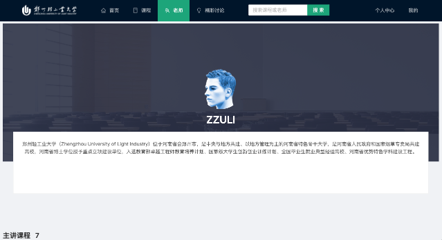
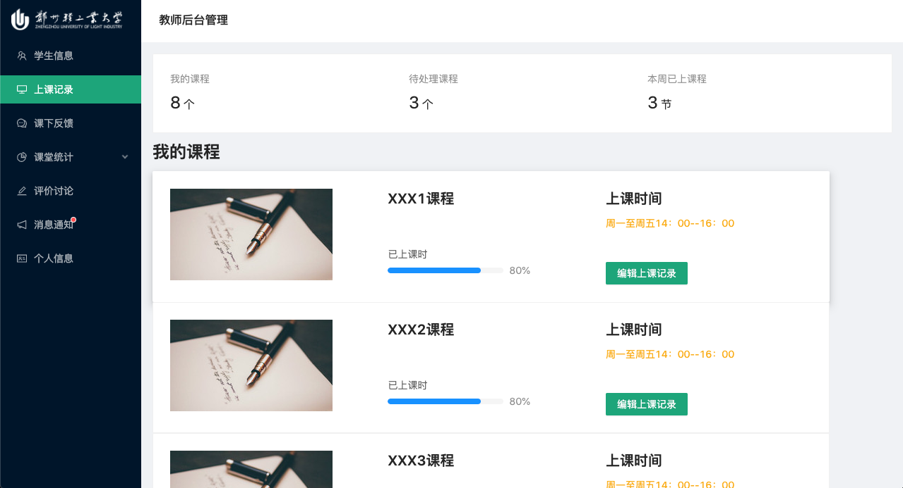
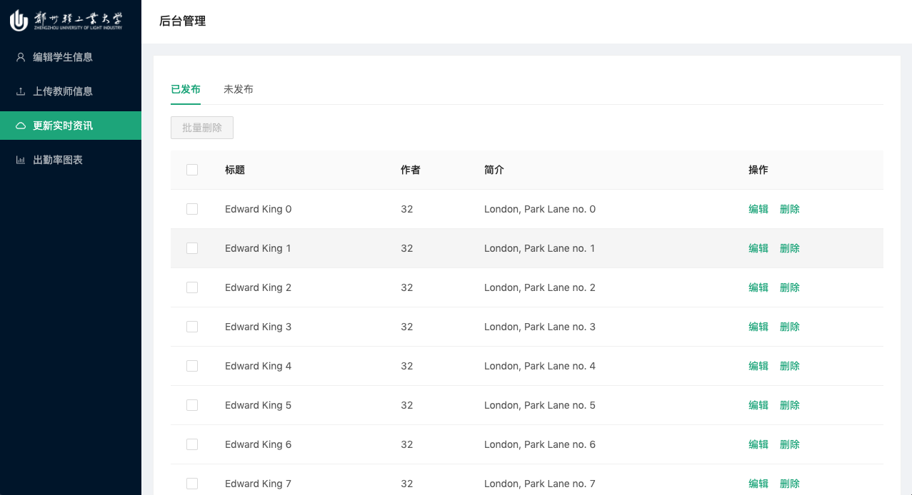
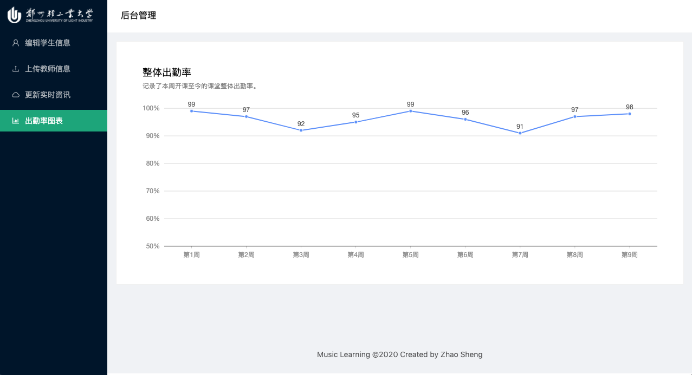

# 一站式音乐学习平台

一款集学生端，教师端，管理员后台于一体的综合学习管理平台，从课堂到线下形成一套完整的管理体系。

## 框架
- Create React App
- AntV/G2

## 用户角色
- 学生
- 教师
- 管理员

## 主要功能
- 基础信息管理
- 学生作业管理
- 老师管理
- 音乐练习管理
- 课堂管理
- 资讯通知管理
- 等。。。。。。

### 学生
- 接收信息资讯
- 选择上课教师
- 选择上课种类
- 预约时间
- 课堂反馈及评分
- 网上报名赛事
- 等...... 

### 教师
- 接收信息管理
- ~~文件上传汇报~~ 
- 讯息接收
- 学生管理
- 学生数据图表查看
- 课下反馈
- 等......

### 管理员
- 上传编辑学生信息
- 上传编辑老师信息
- 实时更新信息资讯
- 出勤率图表生成
- 等......

## 界面需求
登录界面：实行三种模式登录，学生、教师、管理员。登录后进入不同的界面。
### 学生界面
1. 个人信息注册（头像、姓名、年龄、音乐学习基础、家长姓名、手机号）
2. 老师资料查看（对时事更新的老师资料进行浏览查询）（浏览可分人名查找或上课种类查询）
3. 选择课程
4. 预约上课时间（对选中的老师进行固定时间段的选择）
5. 上课信息浏览（上课老师、种类、上课日期时间、上课时长、试课/正课，查看评语）
6. 学生对教师评价（意见反馈后对应教师端接受信息）
7. 线下提问
8. 学习交流区（交流讨论区）
9. 浏览资讯页面（发布的公告、发布的最新新闻、发布赛事、优秀学生视频展播等）

### 教师界面
1. 个人信息填写页面（头像、姓名、年龄、教学时常、.....等等）
2. 学生信息浏览页面
3. 上课记录查看
4. 对学生进行课下反馈
5. 查看图表（按月学生上课次数、出勤、请假等）
6. 查看学生评价
7. 接受讯息通告（管理员对于工作上通知）
8. 浏览资讯页面

### 管理员界面
1. 用户信息维护：新增、修改、删除
2. 用户信息查询：查询关键字
3. 教师信息管理
3. 对浏览资讯页面的信息编辑（发布的公告、发布的最新新闻、发布赛事、优秀学生视频展播等）

## 部分页面预览

登录

学生端主页

教师详情

教师后台上课记录

管理员后台

统计信息
## 项目部署
1. 克隆代码到本地
`https://github.com/ZhaoSheng2000/MusicLearning.git`
2. 执行 `yarn start`
## LICENSE
Apache License 2.0

